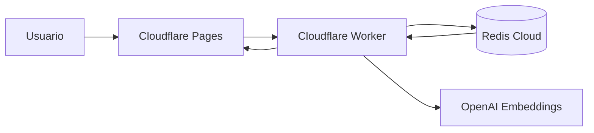

# Cactus Gaming Search

Demo de busca para jogos e apostas usando Redis como motor de search de baixa latencia na borda.

A demo foi pensada para um caso realista do mercado brasileiro: usuarios digitam apelidos, erros foneticos, nomes incompletos e termos de intencao como `aviaosinhu`, `triguinho`, `mengaum` ou `velho alguma coisa`. O Redis entra como uma camada unica para autocomplete, full-text search, sinonimos, intents curados, cache e busca hibrida texto + vetor.

## Demo

- Frontend: https://cactus-demo.pages.dev
- Worker API: https://cactus-worker.platformengineer.workers.dev
- Repository: https://github.com/gacerioni/cactus-gaming-search

Teste rapido:

```bash
curl -X POST https://cactus-worker.platformengineer.workers.dev/api/search \
  -H 'Content-Type: application/json' \
  -d '{"query":"aviaosinhu"}'
```

## Por que Redis aqui

Redis e uma boa escolha para este problema porque a base de jogos e eventos nao precisa ser enorme para entregar uma experiencia muito melhor que busca literal. O ganho vem de combinar varias tecnicas em uma API simples e rapida:

- Autocomplete com `FT.SUGGET`
- Full-text search com pesos por campo
- Sinonimos e termos protegidos para portugues brasileiro
- Spellcheck para erros comuns de digitacao
- Intents curados para buscas de cauda curta e girias
- Vector search com embeddings OpenAI
- Hybrid search com `FT.HYBRID` e RRF fusion
- Cache de embeddings e cache de resultados no proprio Redis
- Filtros por tags/categoria/provider antes do ranking
- Observabilidade de latencia por etapa no frontend

## Exemplos de comportamento

| Query do usuario | Resultado esperado | O que acontece |
| --- | --- | --- |
| `aviaosinhu` | Aviator | spellcheck + intent + busca hibrida |
| `jogo do aviãozinho` | Aviator | intent curado + rewrite semantico |
| `triguinho` | Fortune Tiger | apelido brasileiro mapeado para o jogo |
| `velho alguma coisa` | Gates of Olympus | intent para Zeus/Olimpo |
| `mengaum` | Flamengo | spellcheck + sinonimos de time |
| `black jack` | Blackjack Brasileiro | normalizacao e busca textual |
| `roletinha` | Roleta Brasileira | sinonimo/intent de live casino |

Essas regras estao em [`search_intents.json`](./search_intents.json). Elas nao ficam hardcoded no ranking: o seed grava a curadoria no Redis e o Worker consulta em runtime.

## Arquitetura



Componentes principais:

- [`frontend/`](./frontend/) - UI da demo em Cloudflare Pages
- [`worker/`](./worker/) - API edge em Cloudflare Worker
- [`seed/`](./seed/) - seed Python que popula Redis com HASH, autocomplete, intents, sinonimos e embeddings
- [`games_data.json`](./games_data.json) - dataset demo de jogos/eventos
- [`search_intents.json`](./search_intents.json) - curadoria de termos brasileiros e intents
- [`golden_search.json`](./golden_search.json) - casos de regressao da demo
- [`scripts/run_golden_search.mjs`](./scripts/run_golden_search.mjs) - teste automatizado da API publicada

O backend antigo em [`backend/`](./backend/) permanece no repositorio como referencia, mas a demo atual usa a arquitetura edge: Cloudflare Worker direto no Redis Cloud.

## Pipeline de busca

1. Normaliza a query: caixa baixa, sem acentos e sem pontuacao.
2. Procura um intent deterministico no Redis.
3. Verifica o cache de resultado.
4. Se houver cache hit, retorna direto e pula spellcheck, embedding, OpenAI e `FT.HYBRID`.
5. Se nao houver cache hit, roda spellcheck.
6. Busca ou cria o embedding da query/rewrite.
7. Executa `FT.HYBRID` combinando texto e vetor.
8. Aplica boost de intent, popularidade e limpeza do ranking.
9. Grava o resultado no Redis com TTL.

### Cache

Ha dois caches principais no Redis:

- `cache:search:*` - resposta completa da busca
- `cache:embedding:*` - vetor gerado pelo OpenAI

TTLs atuais:

- Busca curta ou com intent: 1 hora
- Busca longa: 5 minutos
- Embedding: 7 dias

Na UI, o painel `Trace` mostra a latencia atomizada:

- Redis connection
- Redis result cache
- Intent lookup
- Spellcheck
- Embedding cache
- OpenAI embedding
- Redis FT.HYBRID
- Total edge

Em cache hit, a demo mostra `skipped` para as etapas que nao precisaram rodar.

## API

### Search

```bash
curl -X POST https://cactus-worker.platformengineer.workers.dev/api/search \
  -H 'Content-Type: application/json' \
  -d '{"query":"triguinho"}'
```

Com filtro:

```bash
curl -X POST https://cactus-worker.platformengineer.workers.dev/api/search \
  -H 'Content-Type: application/json' \
  -d '{"query":"aviaozinho","filters":{"categoria":"crash"}}'
```

### Autocomplete

```bash
curl "https://cactus-worker.platformengineer.workers.dev/api/autocomplete?q=avia"
```

### Metrics

```bash
curl "https://cactus-worker.platformengineer.workers.dev/api/metrics"
```

### Vector Search

```bash
curl -X POST https://cactus-worker.platformengineer.workers.dev/api/vector-search \
  -H 'Content-Type: application/json' \
  -d '{"query":"jogo crash com avião"}'
```

## Setup local

Requisitos:

- Node.js 22+
- Python 3.12+
- Redis Cloud com Redis Query Engine
- Chave OpenAI para embeddings
- Wrangler autenticado para deploy Cloudflare

### 1. Popular Redis

```bash
cd seed
python3 -m venv .venv
source .venv/bin/activate
pip install -r requirements.txt
cp .env.example .env
# preencher REDIS_URL e OPENAI_API_KEY
python seed_production_vectors.py
```

### 2. Validar Worker

```bash
cd worker
npm install
npx tsc --noEmit
npx wrangler deploy --dry-run
```

### 3. Rodar golden set

```bash
node scripts/run_golden_search.mjs https://cactus-worker.platformengineer.workers.dev
```

### 4. Deploy completo

O script abaixo limpa Redis, recria indice, gera embeddings, commita/pusha codigo e redeploya Worker + Pages:

```bash
./scripts/deploy_full_reset.sh
```

Use com cuidado porque ele faz `git add`, `git commit` e `git push`.

## Golden set

O golden set evita regressao nos casos que mais importam para a narrativa da demo:

```bash
node scripts/run_golden_search.mjs
```

Ele valida:

- top result esperado
- categoria esperada
- query corrigida quando aplicavel
- metodos usados (`spellcheck`, `intent`, `hybrid`)
- latencia Redis do autocomplete e da busca hibrida

## Estado atual da demo

Seed atual:

- 404 jogos/eventos
- 1028 sugestoes de autocomplete
- 106 termos de intent
- 11 grupos de sinonimos
- embeddings OpenAI `text-embedding-3-small` com 1536 dimensoes

Endpoints publicados:

- Frontend: https://cactus-demo.pages.dev
- API: https://cactus-worker.platformengineer.workers.dev

## Notas

Este repositorio usa um dataset demonstrativo. A parte importante e o padrao: intents, sinonimos, tags, pesos de campo, cache e busca hibrida podem ser portados para um dataset real da Cactus sem mudar a arquitetura principal.
